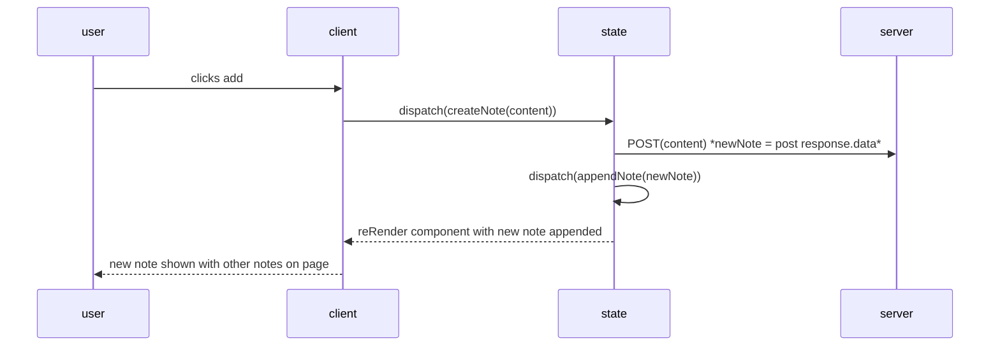

```mermaid
sequenceDiagram
participant user
participant client
participant state
participant server

user->>client: clicks add
client->>state: dispatch(createNote(content))
state->>server: POST(content) *newNote = post response.data*
state->>state: dispatch(appendNote(newNote))
state-->>client: reRender component with new note appended
client-->>user: new note shown with other notes on page

```
